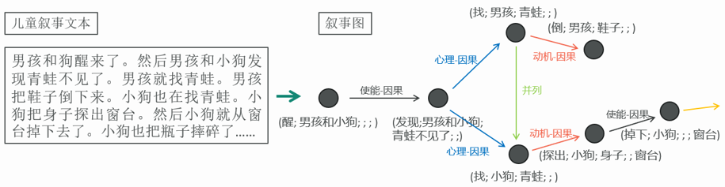
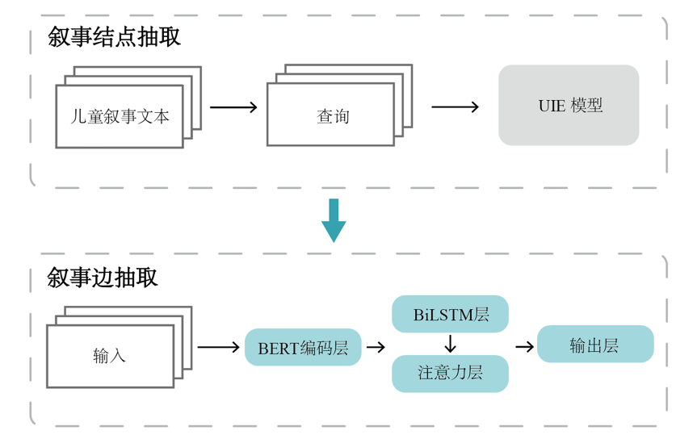
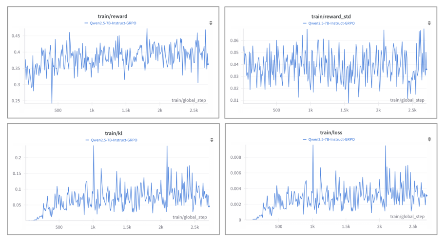
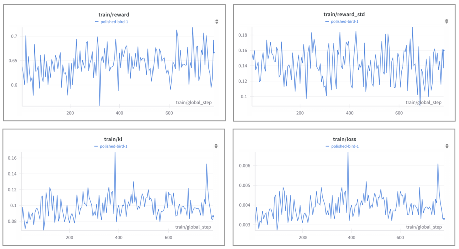

# 儿童叙事文本的结构化叙事图构建

> Structured Narrative Graph Construction from Children's Narrative Texts
> 南京师范大学 人工智能专业 本科毕业设计 (2025)

从儿童口述的故事文本中，自动抽取**事件**及其**语义关系**，构建可视化的「叙事图」，为儿童语言能力评估提供自动化工具。

本项目对比了 **传统深度学习方法** 与 **大语言模型方法（SFT / GRPO 强化学习）** 在该任务上的表现，并得到了一些与直觉相反的结论。

---

## 目录

- [问题背景](#问题背景)
- [任务定义](#任务定义)
- [方法](#方法)
- [实验结果](#实验结果)
- [关键发现](#关键发现)
- [仓库结构](#仓库结构)
- [环境与复现](#环境与复现)
- [数据说明](#数据说明)

---

## 问题背景

叙事能力是儿童语言能力的核心组成部分，能反映儿童组织事件、进行结构化表达的能力，也是**早期筛查语言障碍（如自闭症谱系障碍）的重要指标**。

但目前的评估方式主要依赖**人工观察与文本分析**，存在三个问题：

- 效率低下，难以支撑大规模筛查
- 主观性强，不同评估者结论不一致
- 反馈周期长，容易错过早期干预时机

本项目尝试用 NLP 技术把这个过程自动化：输入一段儿童讲述的故事，输出一张结构化的叙事图。

## 任务定义

**叙事图**由结点和边构成：

- **结点 = 事件**，表示为五元组 `(触发词；主语；宾语；时间状语；地点状语)`
- **边 = 事件间关系**，共 5 类：并列、动机-因果、心理-因果、物理-因果、使能-因果



*从儿童叙事文本到叙事图：结点为事件五元组，边为事件间的语义关系*

输入输出示例：

```
输入（儿童叙事文本）:
  男孩和狗醒来了。然后男孩和小狗发现青蛙不见了。男孩就找青蛙。

抽取的结点:
  (醒；男孩和小狗；无；无；无)
  (发现；男孩和小狗；青蛙不见了；无；无)
  (找；男孩；青蛙；无；无)

抽取的边:
  事件1 → 事件2   使能-因果
  事件2 → 事件3   心理-因果
```

### 这个任务难在哪

与常规信息抽取任务相比，本任务有两个额外挑战：

1. **半开放域事件抽取** — 事件不限于预定义的事件类型集合，比传统封闭域事件抽取更难
2. **关系类型多样且隐含** — 儿童叙事中很少出现显式的时间词或逻辑连接词，关系判断高度依赖上下文推断

此外，儿童口语文本本身逻辑跳跃、表达不规范，包含大量动补短语（"摔倒""醒来"）和带定语的论元（"一个小男孩"），标注边界难以统一。

## 方法

项目沿两条技术路线展开，均采用**两阶段框架**（先抽结点，再抽边）：

### 路线一：传统深度学习

| 子任务 | 模型 |
|---|---|
| 结点抽取 | RexUIE（通用信息抽取模型，递归查询机制） |
| 边抽取 | BiLSTM-Attention（Chinese RoBERTa 编码 + 双向 LSTM + 缩放点积注意力） |



### 路线二：大语言模型

**监督微调（SFT）** — 基于 LoRA 的参数高效微调，使用 Unsloth 框架

- 联合式抽取：一次性输出结点与边（DeepSeek-R1-Distill-Qwen-7B）
- 分步抽取：结点、边分别微调（Qwen2.5-1.5B/7B-Instruct、DeepSeek-R1-Distill-Qwen-1.5B/7B）

**强化学习（GRPO）** — Group Relative Policy Optimization，自定义奖励函数

结点抽取任务的三个奖励函数：

| 奖励函数 | 权重 | 作用 |
|---|---|---|
| 格式规范 | 0.3 | 检查五元组括号与分号格式 |
| 答案正确性 | 0.5 | 逐字段计算 F1 分数 |
| 逻辑一致性 | 0.2 | 校验抽取的论元是否真实出现在原文中，抑制幻觉 |

边抽取任务的三个奖励函数（引导模型产生显式推理过程）：

| 奖励函数 | 权重 | 作用 |
|---|---|---|
| 格式规范 | 0.2 | 检查 `<推理过程>` / `<答案>` 标签完整性 |
| 答案正确性 | 0.5 | 正确得 1.0，否则按关系类型相似度矩阵给分 |
| 推理过程质量 | 0.3 | 检查推理是否覆盖必要判断步骤、逻辑是否完整 |

此外还尝试了 **GRPO 联合式抽取**（一次性输出结点与边），设计了格式规范、字段准确性、关系准确性三个奖励函数，并要求模型按 `<事件列表>` / `<关系列表>` 标签结构化输出。受限于试错成本与设备资源，该方向未能充分展开，代码保留在仓库中作为探索记录。

#### GRPO 训练过程

结点抽取任务（Qwen2.5-7B-Instruct）：



reward 波动较大但长期呈上升趋势，loss 整体下降，训练在逐步优化。

边抽取任务：



reward 持续振荡且未能良好收敛，说明奖励函数设计仍有改进空间——这也是该方案最终效果不及监督微调的原因之一。

## 实验结果

### 叙事结点（事件）抽取

| 方法 | P | R | F1 |
|---|---|---|---|
| RexUIE（深度学习） | 61.2 | 57.2 | 59.1 |
| DeepSeek-R1-7B · zero-shot | 30.6 | 46.7 | 36.9 |
| DeepSeek-R1-7B · few-shot | 35.0 | 51.9 | 41.8 |
| **DeepSeek-R1-7B · SFT 联合式** | **78.0** | 74.1 | **76.0** |
| Qwen2.5-1.5B · SFT | 66.1 | **79.0** | 72.0 |
| Qwen2.5-7B · SFT | 65.7 | 78.3 | 71.4 |
| Qwen2.5-7B · GRPO | 72.6 | 70.1 | 71.3 |

> 大模型生成式抽取采用基于语义相似度（余弦相似度 ≥ 0.8）的宽松匹配准则，以缓解标注边界不统一带来的评估偏差。

### 叙事边（关系）抽取

| 方法 | Macro F1 | Micro F1 |
|---|---|---|
| **BiLSTM-Attention（深度学习）** | **67.8** | **84.9** |
| DeepSeek-R1-7B · zero-shot | 0.5 | 0.4 |
| DeepSeek-R1-7B · few-shot | 5.1 | 11.5 |
| DeepSeek-R1-7B · SFT 联合式 | 28.1 | 31.5 |
| DeepSeek-R1-1.5B · SFT 分步 | 52.2 | 71.5 |
| DeepSeek-R1-7B · SFT 分步 | 49.4 | 49.4 |
| Qwen2.5-7B · GRPO | 28.9 | 29.2 |

**联合式 → 分步式带来的提升最为显著：Macro F1 从 28.1% 提升至 52.2%。**

### 分关系类型表现（BiLSTM-Attention）

| 关系类型 | P | R | F1 | 训练样本数 |
|---|---|---|---|---|
| 使能-因果 | 91.6 | 85.3 | **88.4** | 6869 |
| 动机-因果 | 86.5 | 89.1 | **87.8** | 2191 |
| 心理-因果 | 77.1 | 73.0 | 75.0 | 756 |
| 物理-因果 | 64.7 | 70.6 | 67.6 | 243 |
| 并列 | 87.5 | 11.3 | **20.0** | 443 |

## 关键发现

**1. 大模型不一定越大越好，本任务对模型体量不敏感**

Qwen2.5-1.5B 在结点抽取上（72.0）略优于 7B（71.4）；边抽取上 DeepSeek-R1-1.5B（52.2）明显优于 7B（49.4）。

原因推测：边抽取本质是 5 分类任务，不需要大模型的通用能力，小参数模型反而能更专注地学习任务特定表达。实验中 7B 模型出现明显过拟合——训练 loss 快速下降后维持低位，验证 loss 先降后升。通过**降低学习率、减少 LoRA 微调模块数量、调低秩 r** 有效缓解。

**2. 联合式抽取看似高效，实则学到的是"样式"而非"结构"**

一次性输出结点与边时，结点抽取 F1 可达 76.0（全场最高），但边抽取仅 28.1。说明模型可能只是浅层模仿了输出格式，并未真正理解结点与边之间的语义依赖。改为分步抽取后边抽取性能接近翻倍。

**3. 两条路线各有所长**

- **大模型更适合结点抽取**：语义理解与泛化能力强，能应对半开放域的事件类型
- **深度学习小模型更适合边抽取**：BiLSTM-Attention（Macro 67.8）仍优于最好的大模型方案（52.2）

**4. 长尾分布是边抽取的主要瓶颈**

并列关系精确率高达 87.5 但召回率仅 11.3 —— 模型预测极度保守。与样本量相近的物理-因果（F1 67.6）对比可见，问题不只在数据量：并列关系的判断依赖"时间重叠"这一隐含信息，而儿童叙事中极少出现显式时间词。

**5. 后续改进方向**

将边抽取重构为**图上的边分类问题**，引入图神经网络（GNN）显式建模事件结点间的结构化关系，而非将其视为纯文本分类。

## 仓库结构

```
.
├── notebooks/
│   ├── 01_deep_learning/
│   │   └── bilstm_attention_relation_extraction.ipynb   # BiLSTM-Attention 边抽取
│   ├── 02_llm_sft/
│   │   ├── baseline_zeroshot_fewshot_sft_deepseek7b.ipynb   # 0-shot / 2-shot / SFT 基线对比
│   │   ├── event_extraction_deepseek7b_prompt_comparison.ipynb  # 结点抽取 + 四版提示词对比
│   │   ├── event_extraction_qwen1.5b_prompt_ablation.ipynb  # 结点抽取 + 提示词消融
│   │   ├── event_extraction_qwen7b.ipynb                # 结点抽取 (7B)
│   │   ├── joint_extraction_deepseek7b_v1_with_dataprep.ipynb  # 联合式抽取 v1 + 数据预处理
│   │   └── joint_extraction_deepseek_r1_qwen7b.ipynb    # 联合式抽取 v2
│   └── 03_llm_grpo/
│       ├── event_extraction_grpo_qwen7b.ipynb           # GRPO 结点抽取
│       ├── relation_extraction_grpo_qwen7b.ipynb        # GRPO 边抽取
│       └── joint_extraction_grpo_deepseek7b.ipynb       # GRPO 联合式抽取（探索性）
├── assets/                 # 架构图与训练曲线
├── docs/
│   └── experiments.md      # 各实验的超参数明细、提示词设计、奖励函数说明
├── requirements.txt
└── README.md
```

### Notebook 与实验的对应关系

| Notebook | 任务 | 方法 | 基座模型 |
|---|---|---|---|
| `bilstm_attention_relation_extraction` | 边抽取 | BiLSTM-Attention | Chinese RoBERTa |
| `baseline_zeroshot_fewshot_sft_deepseek7b` | 结点抽取 | 0-shot / 2-shot / LoRA SFT 对比 | DeepSeek-R1-Distill-Qwen-7B |
| `joint_extraction_deepseek7b_v1_with_dataprep` | 结点 + 边 | 数据预处理 + LoRA SFT | DeepSeek-R1-Distill-Qwen-7B |
| `joint_extraction_deepseek_r1_qwen7b` | 结点 + 边 | LoRA SFT | DeepSeek-R1-Distill-Qwen-7B |
| `event_extraction_deepseek7b_prompt_comparison` | 结点抽取 | 提示词对比 + LoRA SFT | DeepSeek-R1-Distill-Qwen-7B |
| `event_extraction_qwen1.5b_prompt_ablation` | 结点抽取 | LoRA SFT | Qwen2.5-1.5B-Instruct |
| `event_extraction_qwen7b` | 结点抽取 | LoRA SFT | Qwen2.5-7B-Instruct |
| `event_extraction_grpo_qwen7b` | 结点抽取 | GRPO | Qwen2.5-7B-Instruct |
| `relation_extraction_grpo_qwen7b` | 边抽取 | GRPO | Qwen2.5-7B-Instruct |
| `joint_extraction_grpo_deepseek7b` | 结点 + 边 | GRPO（探索性） | DeepSeek-R1-Distill-Qwen-7B |

> **两组提示词实验**：
> - `event_extraction_deepseek7b_prompt_comparison` — 对比四种提示词风格（专家身份 + 示例 / 极简格式 / 对话式 / 分步骤引导），并在其中两版上分别微调
> - `event_extraction_qwen1.5b_prompt_ablation` — 对比「仅给出格式要求」与「额外给出句法分析引导步骤」两种设计对抽取效果的影响

## 环境与复现

实验在 Google Colab（A100 40GB / RTX 3090 24GB）上完成。

```bash
pip install -r requirements.txt
```

核心依赖：

- `unsloth` — LoRA 微调与推理加速
- `trl` — SFTTrainer / GRPOTrainer
- `vllm` — GRPO 训练中的快速采样
- `transformers` / `peft` / `torch`

Notebook 中的 Hugging Face token 与 wandb token 均通过 `google.colab.userdata` 读取，**不包含任何硬编码密钥**。自行运行时需在 Colab Secrets 中配置 `HUGGINGFACE_TOKEN` 与 `wandb_token`。

微调后的模型权重已上传至 Hugging Face Hub（`Venassa/*`）。

## 数据说明

本项目使用的儿童叙事语料库为实验室自建资源：

- 采集方式：被试根据无字图画书《Frog, Where Are You?》进行故事讲述，由语言学专业师生人工转录
- 覆盖范围：3–13 岁儿童 + 成人对照组
- 标注方式：14 位经培训的标注者两两交叉标注、比对与讨论
- 规模：543 篇文档 / 22,774 句 / 19,916 个事件 / 32,998 个论元 / 16,124 条关系
- 划分：按年龄分布以 7:2:1 划分训练集、验证集、测试集

| | 文档 | 句子 | 事件 | 论元 | 关系 |
|---|---|---|---|---|---|
| 训练集 | 380 | 15,974 | 14,232 | 23,710 | 11,542 |
| 验证集 | 108 | 4,359 | 3,571 | 5,819 | 3,017 |
| 测试集 | 55 | 2,441 | 2,113 | 3,469 | 1,565 |

**语料涉及儿童受试者数据，出于隐私保护与数据合规考虑，本仓库不包含原始语料。** 本人负责建模、训练与评估工作；语料标注为团队协作完成。

---

## 引用与致谢

- RexUIE — Liu et al., *RexUIE: A Recursive Method with Explicit Schema Instructor for Universal Information Extraction*, 2023
- GRPO — Shao et al., *DeepSeekMath: Pushing the Limits of Mathematical Reasoning in Open Language Models*, 2024
- LoRA — Hu et al., *LoRA: Low-Rank Adaptation of Large Language Models*, 2021
- BiLSTM-Attention — Zhou et al., *Attention-Based Bidirectional Long Short-Term Memory Networks for Relation Classification*, ACL 2016
- GRPO 训练代码参考 [@willccbb](https://gist.github.com/willccbb/4676755236bb08cab5f4e54a0475d6fb) 的实现

